# CODE_WIKI — JeeSite Vue 代码维基

> 面向开发者的代码级知识库。本文件是项目代码的"地图"与"说明书"，配合各源码目录下的 `README.md` 与根目录 `RULES.md`、`AGENT.md` 使用。
>
> 版本：5.18.0（pnpm workspace + Turbo monorepo）
> 更新时间：2026-08-05

---

## 1. 项目依赖

### 1.1 包管理

- **包管理器**：`pnpm`（workspace 模式），工作区定义见 `pnpm-workspace.yaml`。
- **构建编排**：`turbo.json`（TurboRepo），按依赖拓扑并行构建。
- **统一版本**：所有 `@jeesite/*` 包版本号统一为 `5.18.0`。
- **代码检查**：oxlint + ESLint（`eslint.config.mjs`）+ Prettier + Stylelint（`stylelint.config.mjs`）+ UnoCSS（`uno.config.ts`）。

### 1.2 Workspace 包清单（包图见 §3）

| 包 | 路径 | 职责 | 依赖 |
|----|------|------|------|
| `web` | `web/` | 应用入口（极薄层：main.ts + App.vue + vite.config） | core/cms/dbm/dfm/app |
| `@jeesite/core` | `packages/core/` | 核心框架：hooks、组件、页面、路由、状态、API、布局、工具 | vite/types/assets |
| `@jeesite/cms` | `packages/cms/` | 内容管理系统（站点/栏目/文章/AI 对话） | core |
| `@jeesite/dbm` | `packages/dbm/` | 数据库管理（数据源/表结构/数据/实体/Excel/树）+ biz 业务示例 | core |
| `@jeesite/dfm` | `packages/dfm/` | 动态表单设计器（薄包装，导出独立库 `@jeesite/dfm-lib`） | dfm-lib |
| `@jeesite/app` | `packages/app/` | 应用级扩展页面（appComment 应用评论 / appUpgrade 应用升级） | core |
| `@jeesite/vite` | `packages/vite/` | Vite 工具链（插件/主题/构建配置） | types |
| `@jeesite/types` | `packages/types/` | 全局 TypeScript 类型声明 | - |
| `@jeesite/assets` | `packages/assets/` | 静态资源 | - |
| `@jeesite/test` | `packages/test/` | 测试工具 | - |

### 1.3 第三方依赖（技术栈）

| 类别 | 依赖 |
|------|------|
| 框架 | Vue 3.5（Composition API + `<script setup>`）、TypeScript 6、Vue Router 5 |
| 构建 | Vite 8、Turbo、pnpm workspace |
| UI | Ant Design Vue Next（`antdv-next`）1.3、UnoCSS（Wind3 preset） |
| 状态 | Pinia 2.3 |
| 请求 | Axios（自封装 `defHttp`） |
| 图表 | ECharts 6（`useECharts` hook） |
| 富文本/编辑器 | WangEditor、Monaco/CodeMirror（CodeEditor） |
| 国际化 | vue-i18n（`useI18n`） |
| 其他 | lodash-es、dayjs、qrcode、cropper、exceljs 等 |

### 1.4 常用命令

| 命令 | 说明 |
|------|------|
| `cd web && pnpm dev` | 启动开发服务器（代理后端 `http://127.0.0.1:8980/js`） |
| `cd web && pnpm build` | 生产构建（`web/dist/`） |
| `cd web && pnpm type:check` | TypeScript 类型检查 |
| `pnpm install` | 安装全部依赖 |
| `pnpm lint` / `pnpm stylelint` / `pnpm format` | 代码检查与格式化 |

---

## 2. 项目技术架构

### 2.1 分层架构

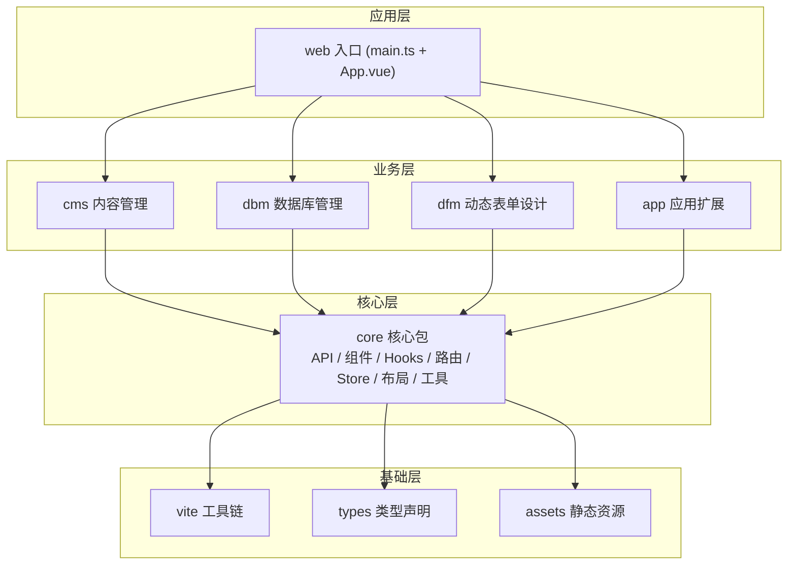

### 2.2 启动流程（严格顺序）

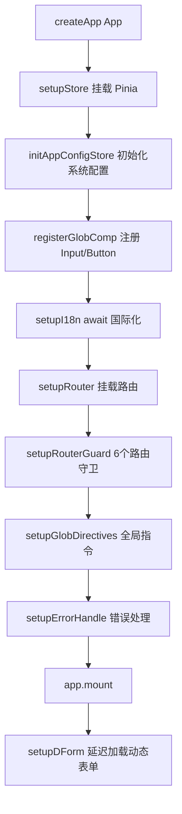

### 2.3 应用组件树

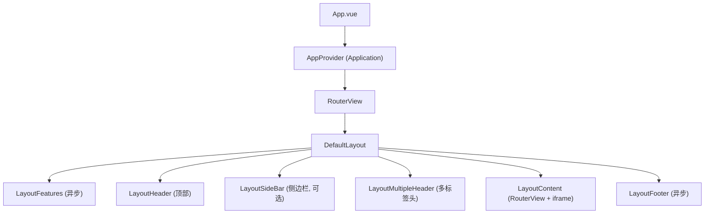

### 2.4 运行时三大支柱

| 支柱 | 位置 | 职责 |
|------|------|------|
| **HTTP 封装** | `packages/core/utils/http/axios/` | `defHttp`，统一 `x-token`、`result` 响应协议、错误处理 |
| **路由与权限** | `packages/core/router/` + `store/modules/permission.ts` | 6 守卫、动态路由、权限码 |
| **Store 状态** | `packages/core/store/modules/` | user / permission / app / multipleTab / locale 等 |

---

## 3. 项目模块划分（包图）

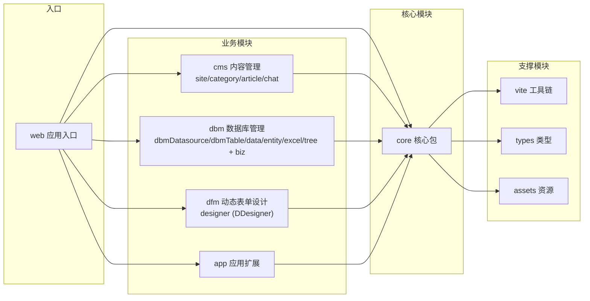

各模块详细分析见下文：

- [§4 core 核心模块](#4-core-核心模块)
- [§5 cms 内容管理模块](#5-cms-内容管理模块)
- [§6 dbm 数据库管理模块](#6-dbm-数据库管理模块)
- [§7 dfm 动态表单设计模块](#7-dfm-动态表单设计模块)
- [§8 app 应用扩展模块](#8-app-应用扩展模块)
- [§9 web 入口与支撑模块](#9-web-入口与支撑模块)

---

## 4. core 核心模块

> 路径：`packages/core/`。核心框架包，提供所有业务模块共用的基础设施。

### 4.1 模块内部结构

```mermaid
graph TD
  CORE["core"]
  CORE --> api["api/ (sys/msg/state 接口)"]
  CORE --> components["components/ (35+ 业务组件)"]
  CORE --> hooks["hooks/ (30+ 组合式函数)"]
  CORE --> layouts["layouts/ (default/iframe/page/views)"]
  CORE --> router["router/ (guard/helper/menus/routes)"]
  CORE --> store["store/ (Pinia 7个store)"]
  CORE --> utils["utils/ (http/auth/cache/cipher/env)"]
  CORE --> views["views/ (sys/msg/state 业务页面)"]
  CORE --> locales["locales/ (国际化)"]
  CORE --> settings["settings/ (projectSetting)"]
  CORE --> directives["directives/ (v-auth/v-loading)"]
  CORE --> enums["enums/ (权限/HTTP/页面枚举)"]
```

### 4.2 用户用例（用例图）

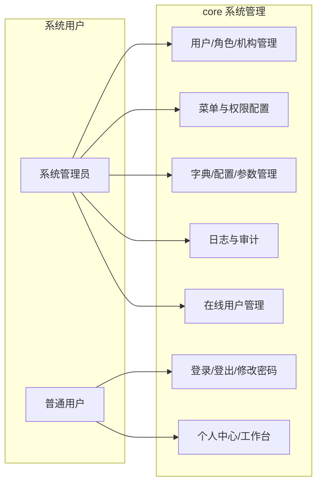

### 4.3 业务流程分析（流程图）

#### 4.3.1 登录认证流程

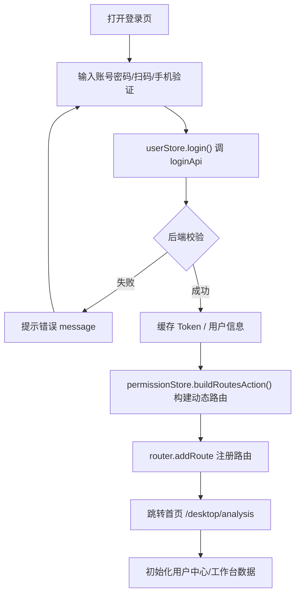

#### 4.3.2 权限校验流程（permissionGuard）

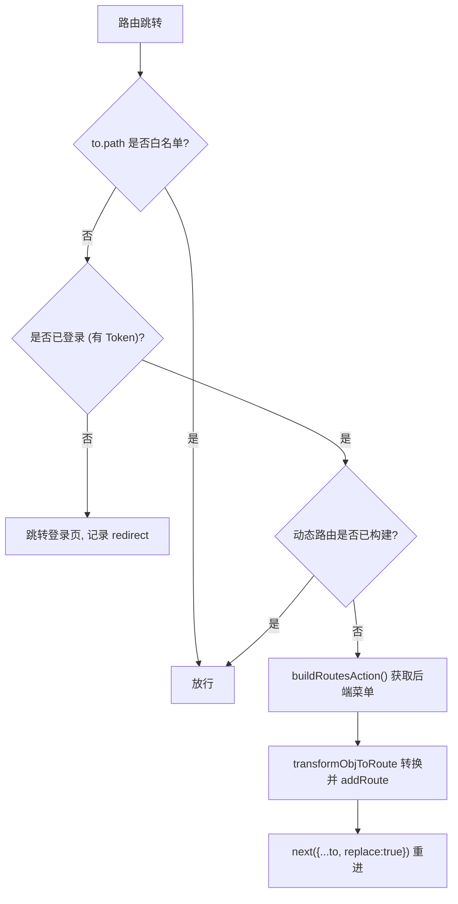

#### 4.3.3 标准 CRUD 流程（三文件模式）

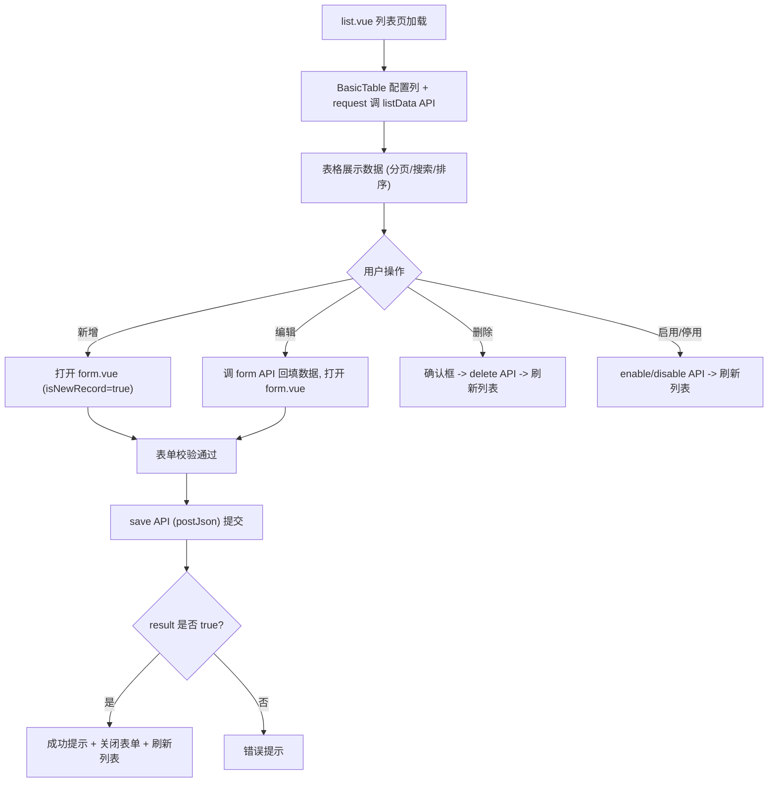

### 4.4 信息交互顺序分析（顺序图）

#### 4.4.1 登录 → 动态路由 → 进入页面

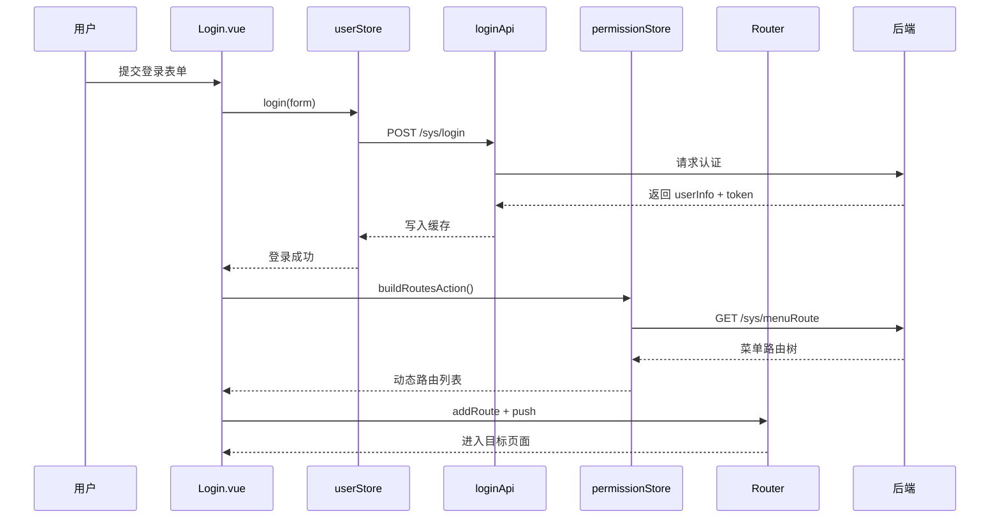

#### 4.4.2 数据请求（defHttp）与响应处理

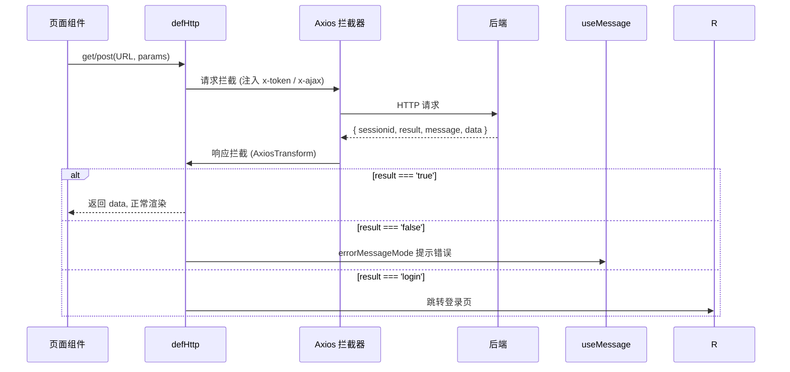

#### 4.4.3 多标签页（Tabs）与内容区切换

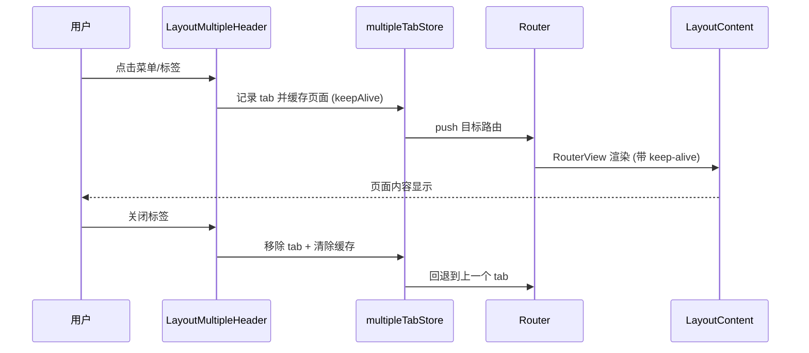

---

## 5. cms 内容管理模块

> 路径：`packages/cms/`。内容管理系统：站点、栏目、文章、AI 对话。

### 5.1 模块内部结构

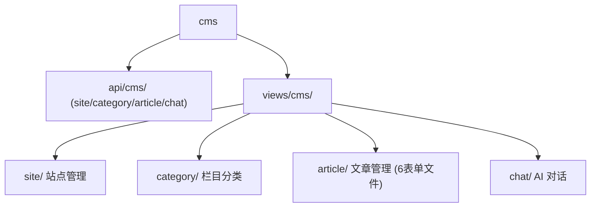

### 5.2 用户用例（用例图）

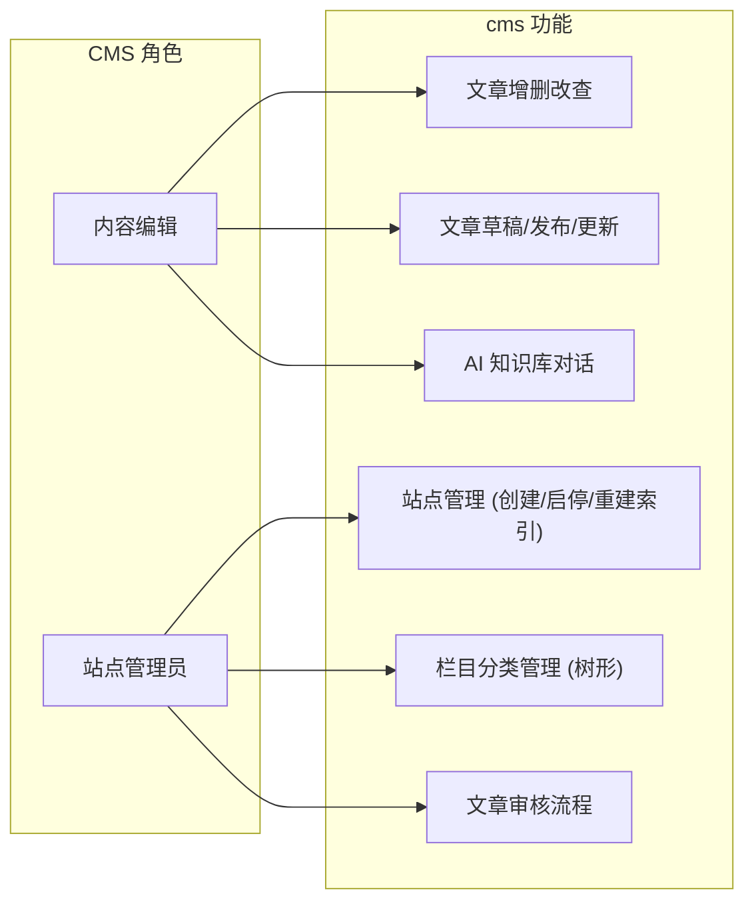

### 5.3 业务流程分析（流程图）

#### 5.3.1 文章发布流程

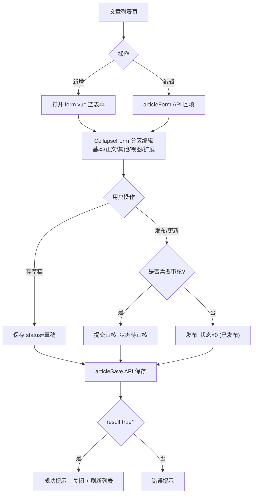

#### 5.3.2 站点重建索引流程

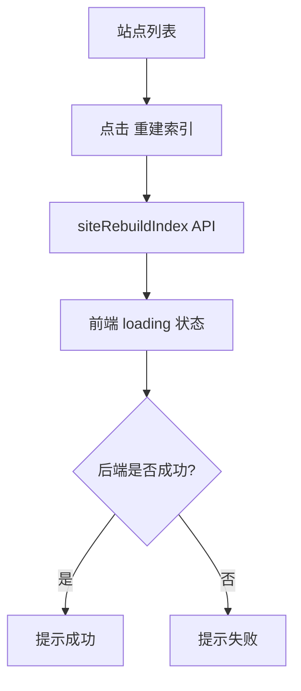

### 5.4 信息交互顺序分析（顺序图）

#### 5.4.1 文章表单保存（分区表单）

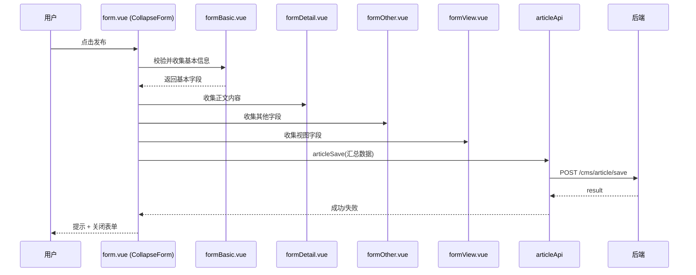

#### 5.4.2 AI 对话流程

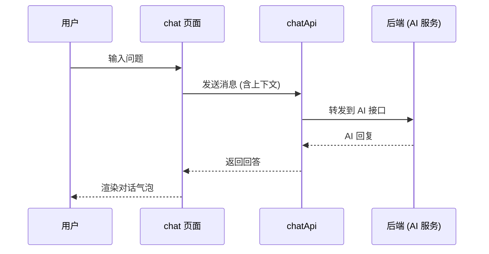

---

## 6. dbm 数据库管理模块

> 路径：`packages/dbm/`。数据库管理：数据源、表结构、数据管理、实体生成、Excel、树形数据；`biz/` 为业务示例（流程分类）。

### 6.1 模块内部结构

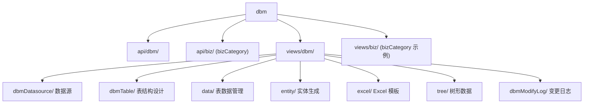

### 6.2 用户用例（用例图）

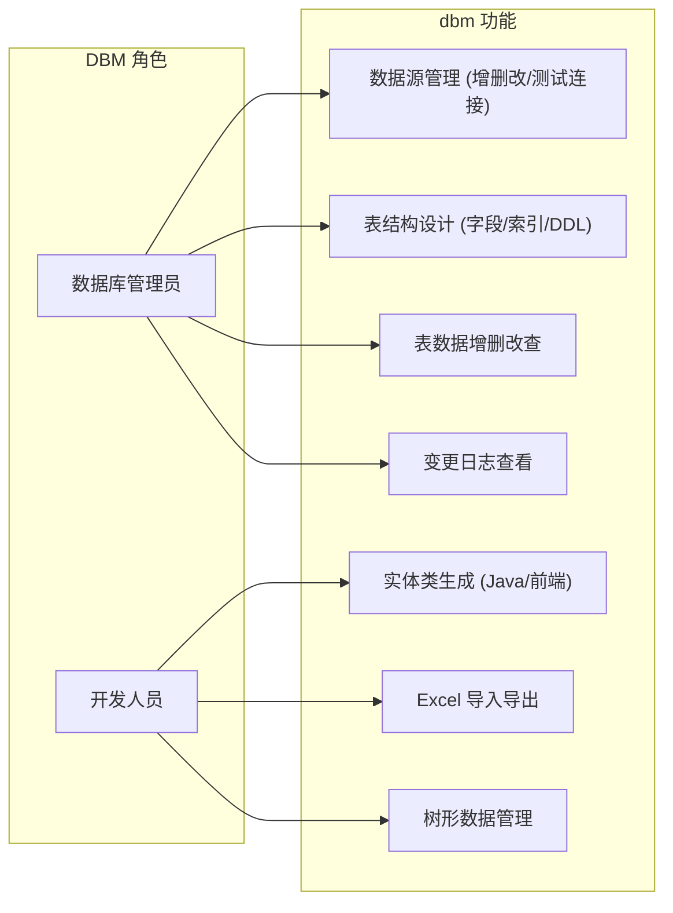

### 6.3 业务流程分析（流程图）

#### 6.3.1 表结构设计流程

```mermaid
flowchart TD
  A["数据源列表"] --> B["选择数据源"]
  B --> C["dbmTable 列表 (该数据源下的表)"]
  C --> D{"操作"}
  D -- 新增表 --> E["填写表名/注释"]
  D -- 编辑表 --> F["修改字段/索引"]
  E --> G["保存 DDL 变更"]
  F --> G
  G --> H{"是否同步到数据库?"}
  H -- 是 --> I["执行 ALTER/CREATE DDL"]
  H -- 否 --> J["仅保存设计"]
  I --> K["记录 dbmModifyLog"]
```

#### 6.3.2 实体生成流程

```mermaid
flowchart TD
  A["选择表"] --> B["点击生成实体"]
  B --> C["选择实体类型 (Java/前端/MyBatis)"]
  C --> D["entity API 生成代码"]
  D --> E["返回代码内容/下载"]
  E --> F["开发人员放入项目"]
```

### 6.4 信息交互顺序分析（顺序图）

#### 6.4.1 数据源测试连接

```mermaid
sequenceDiagram
  participant U as 用户
  participant V as dbmDatasource 页面
  participant API as dbmDatasourceApi
  participant Back as 后端

  U->>V: 填写数据源配置
  V->>API: 测试连接请求
  API->>Back: 后端建立 JDBC 连接
  Back-->>API: 连接结果
  API-->>V: 成功/失败提示
  V-->>U: 显示结果
```

#### 6.4.2 树形数据加载

```mermaid
sequenceDiagram
  participant U as 用户
  participant V as tree 页面
  participant API as treeData API
  participant Back as 后端

  U->>V: 展开树节点
  V->>API: 请求子节点列表
  API->>Back: 查询子级数据
  Back-->>API: TreeDataModel[] (id/pId/name)
  API-->>V: 渲染子树
  V-->>U: 树形展示
```

---

## 7. dfm 动态表单设计模块

> 路径：`packages/dfm/`。薄包装包：`index.ts` 直接导出独立库 `@jeesite/dfm-lib`（`DDesigner`、`pluginManager`）。业务页面仅 `views/dfm/designer/` 一处入口。

### 7.1 模块内部结构

```mermaid
graph TD
  DFM["dfm (薄包装)"]
  LIB["@jeesite/dfm-lib (独立表单设计器库)"]
  DFM --> IDX["index.ts (re-export dfm-lib + 样式)"]
  DFM --> V["views/dfm/designer/ (index.vue 页面包装)"]
  IDX --> LIB
  V --> IDX
```

### 7.2 用户用例（用例图）

```mermaid
graph LR
  subgraph DFM 角色
    DESIGNER["表单设计人员"]
  end

  subgraph dfm 功能
    UC1["新建/编辑动态表单"]
    UC2["拖拽添加表单组件 (input/select 等)"]
    UC3["配置组件属性"]
    UC4["表单预览/发布"]
  end

  DESIGNER --> UC1
  DESIGNER --> UC2
  DESIGNER --> UC3
  DESIGNER --> UC4
```

### 7.3 业务流程分析（流程图）

```mermaid
flowchart TD
  A["进入设计器页面"] --> B["DDesigner 初始化"]
  B --> C["加载组件库 (pluginManager)"]
  C --> D["从组件库拖拽组件到画布"]
  D --> E["选中组件, 配置属性"]
  E --> F{"继续添加?"}
  F -- 是 --> D
  F -- 否 --> G["预览表单"]
  G --> H{"需要调整?"}
  H -- 是 --> D
  H -- 否 --> I["保存表单设计"]
```

### 7.4 信息交互顺序分析（顺序图）

```mermaid
sequenceDiagram
  participant U as 用户
  participant D as DDesigner
  participant PM as pluginManager
  participant API as dfm API
  participant Back as 后端

  U->>D: 打开设计器
  D->>PM: getComponents() 获取组件库
  PM-->>D: 组件列表
  U->>D: 拖拽组件到画布
  U->>D: 配置组件属性
  D->>API: 保存表单 JSON
  API->>Back: POST 保存
  Back-->>API: 成功
  API-->>D: 提示保存成功
  D-->>U: 完成设计
```

---

## 8. app 应用扩展模块

> 路径：`packages/app/`。应用级扩展页面（示例/说明见其 README）。

> 实际内容：`views/app/appComment/`（应用评论，list + form）、`views/app/appUpgrade/`（应用升级，list + form），均为标准三文件 CRUD（见 RULES.md R1）。

### 8.1 用户用例（用例图）

```mermaid
graph LR
  USER["已登录用户"]
  subgraph app 功能
    UC1["应用评论管理 (appComment)"]
    UC2["应用升级管理 (appUpgrade)"]
  end
  USER --> UC1
  USER --> UC2
```

### 8.2 业务流程与顺序图

```mermaid
sequenceDiagram
  participant U as 用户
  participant R as Router
  participant V as app 页面
  participant C as core 基础设施 (API/Hooks)

  U->>R: 访问 app 路由
  R->>V: 渲染页面
  V->>C: 调用 core API / hooks
  C-->>V: 数据
  V-->>U: 展示
```

---

## 9. web 入口与支撑模块

### 9.1 web 应用入口

> 路径：`web/`。仅含 `main.ts` + `App.vue` + `vite.config.ts` + `.env*`，承载启动引导流程（见 §2.2）。

```mermaid
flowchart LR
  subgraph web
    M["main.ts (bootstrap)"]
    A["App.vue"]
    VC["vite.config.ts"]
  end
  M --> A
  M --> ENV[".env* 环境变量"]
  VC --> PLUGINS["@jeesite/vite 插件集"]
```

### 9.2 vite 工具链

> 路径：`packages/vite/`。提供插件（compress/html/legacy/monaco/unocss/visualizer）、构建选项、主题系统、环境变量加载。

```mermaid
flowchart TD
  VITE["vite 工具链"]
  VITE --> P["plugins/ 插件集"]
  VITE --> O["options/ 构建/开发选项"]
  VITE --> T["theme/ 主题系统 (亮暗切换)"]
  VITE --> C["config/ 应用配置"]
```

### 9.3 types / assets / test

| 包 | 内容 |
|----|------|
| `types/` | Axios 的 `Result` 类型、全局 `Recordable` 等声明 |
| `assets/` | 全局静态资源（图标、图片、样式） |
| `test/` | 测试工具集 |

---

## 10. 文档导航

| 文档 | 位置 | 说明 |
|------|------|------|
| **CODE_WIKI（本文件）** | `CODE_WIKI.md` | 代码维基：架构、模块、用例/流程/顺序图 |
| **RULES** | `RULES.md` | 业务通用模式与开发规范 |
| **AGENT** | `AGENT.md` | 给 AI/新成员的工作指南（含本 wiki 引用） |
| 官方架构文档 | `docs/*.md` | 架构、Hooks、组件、页面路由、状态 API、布局专题 |
| core HTTP 封装 | `packages/core/utils/http/axios/README.md` | defHttp 设计与使用 |
| core 路由守卫 | `packages/core/router/guard/README.md` | 6 个守卫详解 |
| core 路由转换 | `packages/core/router/helper/README.md` | 后端菜单 → Vue 路由转换 |
| core Store | `packages/core/store/modules/README.md` | Pinia store 一览 |
| core 布局 | `packages/core/layouts/default/README.md` | 主布局架构 |
| core 登录模块 | `packages/core/layouts/views/login/README.md` | 登录状态机与会话超时 |
| cms 文章表单 | `packages/cms/views/cms/article/README.md` | 分区表单实现 |
| dfm 设计器 | `packages/dfm/views/dfm/designer/README.md` | 动态表单设计器 |
