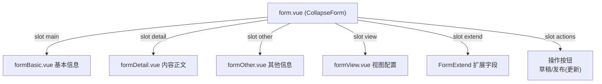

# 文章管理（article）README

> 路径：`packages/cms/views/cms/article/`。CMS 文章管理，采用 **CollapseForm 分区折叠表单**实现复杂多分区编辑，是本项目"复杂表单"的标准范例。

## 文件职责

| 文件 | 职责 |
|------|------|
| `list.vue` | 文章列表（BasicTable）：搜索、分页、状态过滤（草稿/已发布/待审核） |
| `form.vue` | 表单总装：CollapseForm 分区容器 + 分区 slot 装配 + 发布/草稿/审核动作 |
| `formBasic.vue` | 基本信息分区（标题/栏目/作者/关键字等） |
| `formDetail.vue` | 内容正文分区（WangEditor 富文本） |
| `formOther.vue` | 其他信息分区（SEO/显示设置等） |
| `formView.vue` | 视图配置分区（模板/参数等） |

## 表单分区（form.vue）

## 数据流（分区表单收集）

`form.vue` 通过 `ref` 统一驱动各分区：

1. **回填**：`setFieldsValue(values, res)` 依次调用各分区 `setFieldsValue`，扩展字段单独取 `articleData.extend`。
2. **校验**：`validate()` 用 `Object.assign` 合并各分区 `validate()` 结果。
3. **提交**：合并后的数据调用 `articleSave` API。

## 发布/审核状态机

| status | 含义 | 触发操作 |
|--------|------|----------|
| 新建（isNewRecord） | 未保存 | 草稿 / 发布 |
| `'9'` | 草稿 | 草稿保存 / 发布 |
| `'0'` | 已发布 | 更新（改后重新发布） |
| 待审核 | 审核中 | 由后端 `isNeedAudit` 控制 |

发布按钮文案随状态切换：`status == '0' ? '更新' : '发布'`；`okAuth='cms:article:edit'` 控制操作权限。

## 关键点

1. **CollapseForm 组件**：`packages/core/components/CollapseForm`，通过 `formConfig`（label/value/open）声明分区，slot 挂载分区组件。
2. **shallowRef 引用**：分区组件用 `shallowRef<InstanceType<typeof Xxx>>()` 持有，通过 ref 方法通信。
3. **tab 标题**：`useTabs` 的 `setTitle/close` 维护标签页标题与关闭。
4. **emitter**：`useEmitter()` 与列表页通信（刷新列表等）。

## 关联文档

- 文章发布流程图见根目录 `CODE_WIKI.md` §5.3.1
- 分区表单保存顺序图见根目录 `CODE_WIKI.md` §5.4.1
