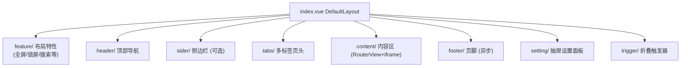

# 主布局（DefaultLayout）README

> 路径：`packages/core/layouts/default/`。后台管理主布局，由 Header + Sider + Tabs + Content + Footer 组合而成，所有区域显示/样式由 settings hooks 控制。

## 组件树

## 目录职责

| 目录 | 说明 |
|------|------|
| `header/` | 顶部：logo、折叠、面包屑、用户下拉、通知、搜索 |
| `sider/` | 侧边菜单：支持 split 分栏、accordion 手风琴、主题 |
| `tabs/` | 多标签：显示/缓存/拖拽/快速操作 |
| `content/` | 内容区：多 RouterView + iframe 支持、keep-alive |
| `feature/` | 布局特性功能（异步加载） |
| `setting/` | 抽屉式主题设置面板（实时修改项目配置） |
| `footer/` | 页脚（异步加载） |
| `trigger/` | 折叠/展开触发器 |

## 配置控制（settings hooks）

| Hook | 控制项 |
|------|--------|
| `useRootSetting` | 主题色、灰阶模式、色弱模式、内容全屏 |
| `useHeaderSetting` | Header 固定/显示/背景色/主题 |
| `useMenuSetting` | 侧栏折叠/宽度/模式/类型/手风琴 |
| `useMultipleTabSetting` | 标签显示/缓存/样式/拖拽/刷新 |
| `useTransitionSetting` | 页面切换动画 |

## 核心设计

1. **配置驱动**：所有区域开关与样式均来自 `settings/projectSetting.ts` + Pinia `app` store，`setting/` 抽屉修改后即时生效并持久化。
2. **iframe 集成**：`content/` 同时支持 Vue 路由组件与外部 iframe 页面（通过 `window.tabPage` 管理）。
3. **异步区域**：`feature/` 与 `footer/` 使用异步组件，按需加载。
4. **keep-alive**：多标签页缓存由 `multipleTabStore` 统一管理，配合 `LayoutContent` 实现页面状态保持。

## 关联文档

- 布局组件树见根目录 `CODE_WIKI.md` §2.3
- 多标签页交互见根目录 `CODE_WIKI.md` §4.4.3
- 布局配置见 `packages/core/settings/projectSetting.ts`
