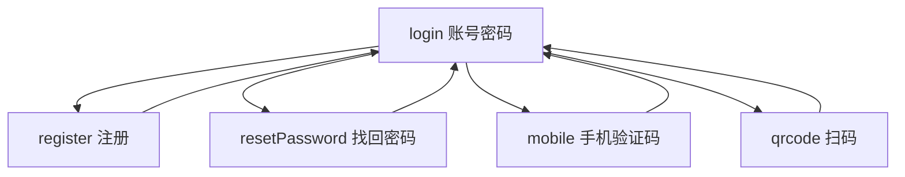
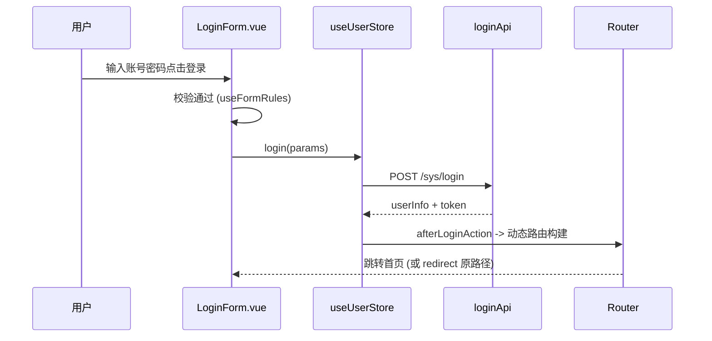

# 登录模块 README

> 路径：`packages/core/layouts/views/login/`。系统登录入口，支持账号密码、手机验证码、扫码、注册、找回密码多种方式。

## 文件职责

| 文件 | 职责 |
|------|------|
| `Login.vue` | 登录页主组件：背景 + 状态切换容器 |
| `LoginForm.vue` | 账号/密码登录表单 |
| `MobileForm.vue` | 手机号验证码登录表单 |
| `QrCodeForm.vue` | 扫码登录表单 |
| `RegisterForm.vue` | 注册表单 |
| `ForgetPasswordForm.vue` | 找回密码表单 |
| `SessionTimeoutLogin.vue` | 会话超时（PAGE_COVERAGE 模式）登录弹层 |
| `LoginFormTitle.vue` | 标题组件 |
| `useLogin.ts` | 登录状态机 + 表单校验规则工具 |

## 登录状态机（useLogin.ts）

- `LoginStateEnum`：`LOGIN / REGISTER / RESET_PASSWORD / MOBILE / QR_CODE`
- `useLoginState()`：切换与读取当前状态
- `useFormRules()`：按当前状态返回对应表单的校验规则集（注册含确认密码、协议勾选校验；找回密码含验证码规则）
- `useFormValid()`：表单整体校验

## 登录提交流程

## 会话超时登录（SessionTimeoutLogin）

`projectSetting.sessionTimeoutProcessing === PAGE_COVERAGE` 时，401 触发页面覆盖式登录弹层（不跳转，保留当前页），登录成功后恢复会话。

## 关键点

1. **会话保持**：登录成功后 `userStore.afterLoginAction()` 构建动态路由并跳转 `redirect` 目标（未登录时拦截器会编码记录 fullPath）。
2. **多方式切换**：同一页面通过 `LoginStateEnum` 切换，组件间用 `useLoginState` 共享状态。
3. **规则集中**：校验规则集中在 `useLogin.ts`，按状态分发，避免各表单重复定义。

## 关联文档

- 登录认证流程图见根目录 `CODE_WIKI.md` §4.3.1
- 登录顺序图见根目录 `CODE_WIKI.md` §4.4.1
- user Store 见 `packages/core/store/modules/README.md`
