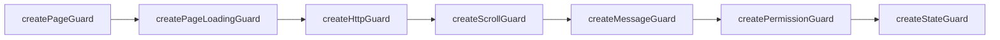

# 路由守卫 README

> 路径：`packages/core/router/guard/`。6 个路由守卫按固定顺序注册，是权限与页面行为的核心控制点。

## 注册顺序（index.ts）



## 各守卫职责

| 守卫 | 文件 | 职责 |
|------|------|------|
| PageGuard | `index.ts` | 页面标题设置、动态标题 |
| PageLoadingGuard | `index.ts` | 页面切换 loading 效果 |
| HttpGuard | `index.ts` | 路由切换时取消未完成 HTTP 请求 |
| ScrollGuard | `index.ts` | 路由切换滚动位置保持 |
| MessageGuard | `index.ts` | 路由切换关闭消息弹层 |
| **PermissionGuard** | `permissionGuard.ts` | 登录校验 + 动态路由构建 + 404 处理（核心） |
| ParamMenuGuard | `paramMenuGuard.ts` | 参数菜单模式支持 |
| StateGuard | `stateGuard.ts` | 页面状态恢复（页面缓存清理等） |

## PermissionGuard 核心逻辑

```mermaid
flowchart TD
  A[beforeEach] --> B{白名单?<br/>login / modPwd}
  B -- 是 --> C[放行]
  B -- 否 --> D{强制改密提示?}
  D -- 是 --> E[跳转改密页]
  D -- 否 --> F{未登录?<br/>sessionTimeout}
  F -- 是 --> G{meta.ignoreAuth?}
  G -- 是 --> C
  G -- 否 --> H[跳转登录页, 携带 redirect]
  F -- 否 --> G2{meta.ignoreAuth?<br/>免登录公开页}
  G2 -- 是 --> C
  G2 -- 否 --> I{userInfo 已获取?}
  I -- 否 --> J[getUserInfoAction]
  I -- 是 --> K{动态路由已添加?}
  K -- 是 --> C
  K -- 否 --> L[buildRoutesAction]
  L --> M[addRoute 动态注册]
  M --> N[重定向到目标页面 (修复 404 与 hash/query 丢失)]
```

## 关键实现细节

1. **白名单**：`whitePathList = [LOGIN_PATH, MOD_PWD_PAGE]`，登录页与改密页无需认证。
2. **redirect 编码**：`encodeURIComponent(to.fullPath)` 保证 `?procDefKey=xx&formVersion=7` 等查询参数不被浏览器错误解析。
3. **404 兜底**：登录后跳转 404 会重定向到 `homePath`；非法 `desktopUrl` 则进入 `/404/`。
4. **hash/query 保留**：动态添加路由后重定向时手动解析并携带 `query` 与 `hash`，避免刷新丢失锚点。
5. **动态路由构建**：`permissionStore.buildRoutesAction()` 从后端菜单转换路由（`transformObjToRoute`），构建后 `setDynamicAddedRoute(true)` 避免重复构建。
6. **免登录公开路由（meta.ignoreAuth）**：token 存在时也会直接放行，跳过 `getUserInfoAction` 与动态路由构建，避免未登录用户访问 `/display/**` 时后端返回 `result='login'` 被拦截器踢到登录页（2026-08-09 修复）。

## 关联文档

- 权限校验流程图见根目录 `CODE_WIKI.md` §4.3.2
- 权限模式配置见 `packages/core/settings/projectSetting.ts`
