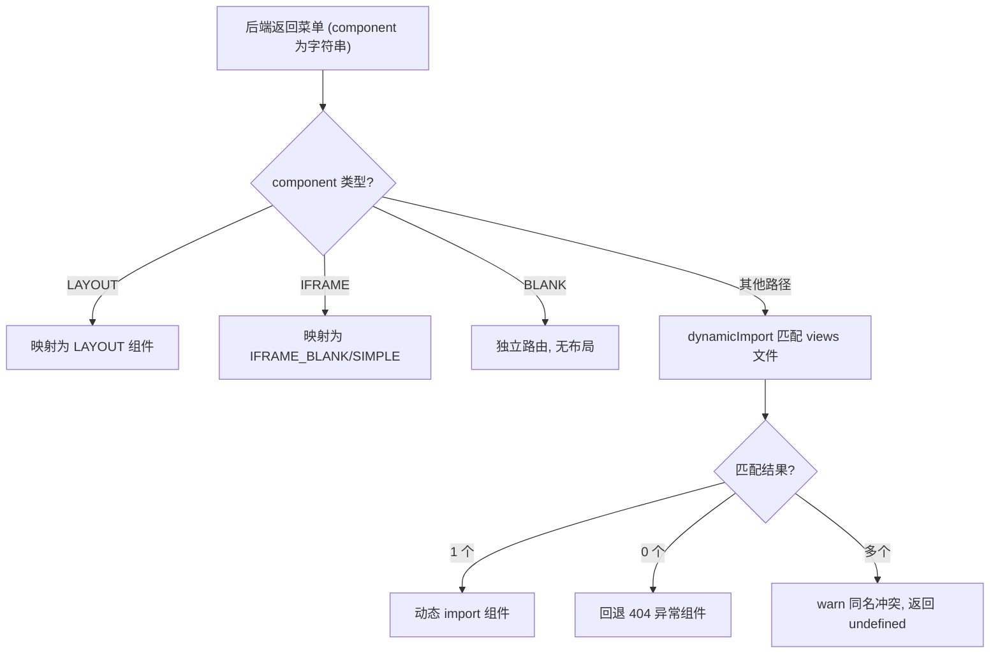
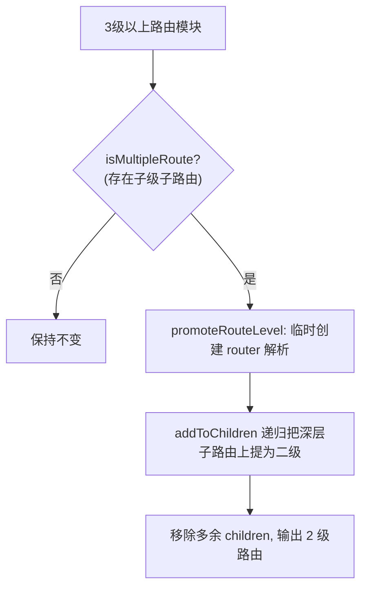

# 路由辅助（helper）README

> 路径：`packages/core/router/helper/`。路由转换核心：后端菜单对象 → Vue Router 路由对象。

## 文件职责

| 文件 | 职责 |
|------|------|
| `routeHelper.ts` | 路由对象转换：`transformObjToRoute`、`dynamicImport`、`flatMultiLevelRoutes` |
| `menuHelper.ts` | 菜单辅助：菜单生成、图标处理、菜单树构建 |

## 核心函数（routeHelper.ts）

| 函数 | 职责 |
|------|------|
| `transformObjToRoute(routeList)` | 后端菜单 → 路由：非 BLANK 菜单包一层 LAYOUT，`BLANK` 直接作为独立路由 |
| `asyncImportRoute(routes, parent, root)` | 递归处理子路由：按字符串组件名动态导入；`LAYOUT`/`IFRAME` 映射常量组件，无法匹配则回退 404 |
| `dynamicImport(component)` | 通过 `import.meta.glob('.../views/**/*.{vue,tsx}')` 按 `/views` 后的路径匹配组件文件 |
| `flatMultiLevelRoutes(routeModules)` | 将 3 级以上路由压平为 2 级（vue-router 4 不支持 3 级以上嵌套菜单） |
| `createRouteHistory()` | 按 `env.VITE_ROUTE_WEB_HISTORY` 选择 history / hash 模式 |

## 动态导入流程

## 压平多级路由（flatMultiLevelRoutes）

## 关键约定

1. **组件名唯一性**：`views/` 下同层级禁止同时存在同名 `.vue` 与 `.tsx`，否则动态导入会因多匹配而失败。
2. **字符串组件名**：后端菜单 `component` 必须为 `/views` 相对路径字符串（如 `sys/user/list`），前端据此动态导入。
3. **BLANK 特例**：`component: 'BLANK'` 的菜单不做布局包裹，常用于外部链接或特殊页面。

## 关联文档

- 动态路由构建流程见根目录 `CODE_WIKI.md` §4.3.2
- 路由守卫见 `packages/core/router/guard/README.md`
