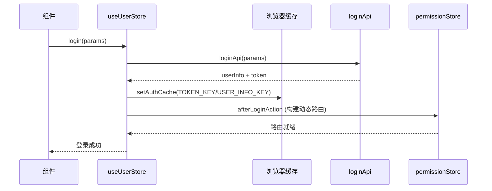

# Pinia Store 模块 README

> 路径：`packages/core/store/modules/`。项目全部 Pinia store，均通过 `packages/core/store/index.ts` 的 `useXxxStoreWithOut()` 在非组件环境（如路由守卫、API）中使用。

## Store 一览

| Store | 名称 | 职责 | 关键状态/Action |
|-------|------|------|-----------------|
| `user.ts` | `app-user` | 用户信息、Token、角色、会话超时 | `login` / `logout` / `getUserInfoAction` / `setToken` / `setUserInfo` / `sessionTimeout` |
| `permission.ts` | `app-permission` | 权限码、动态路由构建 | `buildRoutesAction` / `hasPermission` / `setDynamicAddedRoute` |
| `app.ts` | `app` | 项目配置、主题、页面 loading | `setProjectConfig` / `setPageLoading` |
| `multipleTab.ts` | `app-multiple-tab` | 多标签页状态与缓存 | `addTab` / `closeTab` / 页面 keepAlive 缓存 |
| `errorLog.ts` | `app-error-log` | 前端错误日志收集 | `addErrorInfo` |
| `locale.ts` | `app-locale` | 国际化语言状态 | `setLocale` / 切换语言 |
| `lock.ts` | `app-lock` | 屏幕锁定 | `lock` / `unlock` |

## 使用模式

```ts
// 组件内（推荐）
import { useUserStore } from '@jeesite/core/store/modules/user';
const userStore = useUserStore();

// 非组件环境（API/守卫/工具函数）
import { useUserStoreWithOut } from '@jeesite/core/store/modules/user';
const userStore = useUserStoreWithOut();
```

## user Store 核心流程



## 关键约定

1. **缓存双写**：`state` 与浏览器缓存（`utils/auth` 的 `setAuthCache`）同步，刷新页面后由 getter 兜底恢复。
2. **getter 兜底**：`getToken` / `getUserInfo` 在内存为空时从缓存读取。
3. **页面缓存**：`userStore.pageCache` 通过 mitt 事件驱动，用于刷新页面后恢复状态（配合 `layouts/views` 中相关页面）。
4. **会话超时**：401 时 `setSessionTimeout(true)` 或 `logout(true)`，由 `projectSetting.sessionTimeoutProcessing` 决定。

## 关联文档

- 登录流程/顺序图见根目录 `CODE_WIKI.md` §4.3.1、§4.4.1
- Store 使用规范见根目录 `RULES.md`
