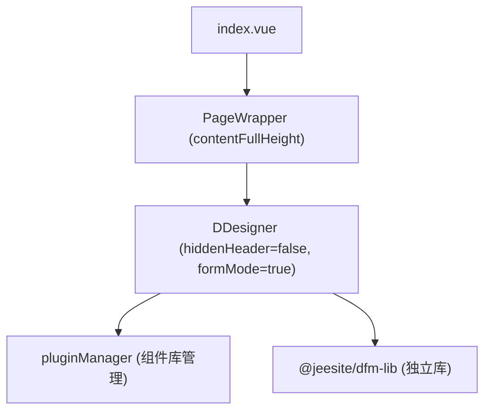

# 动态表单设计器（designer）README

> 路径：`packages/dfm/views/dfm/designer/`。动态表单设计器的页面入口。设计器本体 `DDesigner` / `pluginManager` 由 `@jeesite/dfm` 包 re-export 自独立库 `@jeesite/dfm-lib`。

## 页面结构



## 组件 API

| 项 | 说明 |
|----|------|
| `DDesigner` | 设计器主组件（从 `@jeesite/dfm` 导出，实际来自 `@jeesite/dfm-lib`） |
| `pluginManager` | 组件插件管理器：`getComponents()` 获取组件库、`getComponentConfigs()` 获取配置、`registerComponent()` / `removeComponent()` 动态注册/移除组件 |

```ts
import { pluginManager } from '@jeesite/dfm';

// 注册自定义组件
pluginManager.component.registerComponent(customComponentConfig);
// 读取组件
const components = pluginManager.component.getComponents();
const config = pluginManager.component.getComponentConfigByType('input');
```

## 属性说明

| Prop | 说明 |
|------|------|
| `hiddenHeader` | 是否隐藏设计器头部（此处传 `false` 显示） |
| `formMode` | 表单设计模式（`true`） |

## 关联文档

- 设计器用例图/流程图/顺序图见根目录 `CODE_WIKI.md` §7
- 设计器组件导出见 `packages/dfm/index.ts`（re-export `@jeesite/dfm-lib`：DDesigner、pluginManager）
